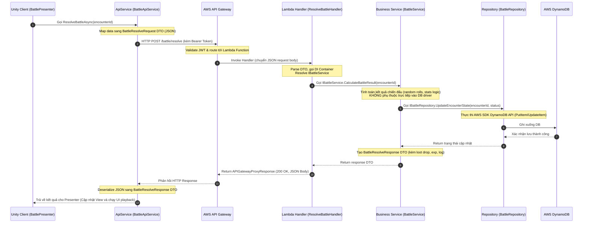

# Thiết Kế Kiến Trúc Monorepo: Unity Client & AWS Serverless Backend (.NET 8)

Bản thiết kế này cung cấp cấu trúc thư mục chuẩn production (Production-Level Monorepo Folder Structure) cho dự án Mobile RPG, tối ưu hóa khả năng tái sử dụng mã nguồn C# giữa client và backend, đồng thời đảm bảo backend dễ dàng tách thành microservices độc lập khi cần thiết.

---

## 1. Folder Tree Monorepo (`/Assets`, `/backend`, `/infrastructure`, `/shared`)

Dưới đây là sơ đồ ASCII tree mô tả chi tiết cấu trúc thư mục của monorepo. Các file quan trọng được liệt kê cụ thể để minh họa cách tổ chức mã nguồn:

```text
/ (Monorepo Root)
├── .gitignore
├── README.md
├── AI-Dungeon-RPG-Adventure-Game.slnx # Solution file mới điều phối dự án
│
├── shared/                         # Thư viện dùng chung (Được compile thành .NET Standard 2.1)
│   ├── GameShared.csproj
│   ├── Models/                     # Domain Entities / DB Mappings (Không chứa logic nghiệp vụ nặng)
│   │   ├── User.cs
│   │   ├── Character.cs
│   │   ├── Item.cs
│   │   ├── Inventory.cs
│   │   ├── Boss.cs
│   │   ├── BossEncounter.cs
│   │   ├── Battle.cs
│   │   ├── LootDrop.cs
│   │   ├── StorySession.cs
│   │   └── StoryAction.cs
│   └── DTOs/                       # Data Transfer Objects (Request/Response API boundaries)
│       ├── Auth/
│       │   ├── LoginRequest.cs
│       │   └── LoginResponse.cs
│       ├── Character/
│       │   ├── CharacterCreateRequest.cs
│       │   └── CharacterDataResponse.cs
│       ├── Story/
│       │   ├── StoryStartRequest.cs
│       │   ├── StoryActionRequest.cs
│       │   └── StoryActionResponse.cs
│       ├── Battle/
│       │   ├── BossSpawnRequest.cs
│       │   ├── BossSpawnResponse.cs
│       │   ├── BattleResolveRequest.cs
│       │   └── BattleResolveResponse.cs
│       └── Inventory/
│           ├── InventoryResponse.cs
│           └── LootDropDTO.cs
│
├── Assets/                         # Unity Client Project (Root Level)
│   ├── Plugins/
│   │   ├── GameShared.dll          # Tự động đồng bộ từ shared project qua PostBuild
│   │   └── GameShared.pdb          # Hỗ trợ hiển thị dòng lỗi khi debug trong Unity
│   ├── Prefabs/
│   ├── Scenes/
│   │   ├── DemoMenu.unity
│   │   ├── StoryScene.unity
│   │   └── BattleScene.unity
│   └── Script/
│       ├── Core/                   # Các service nền tảng, chạy suốt vòng đời game
│       │   └── GameProgressService.cs # Quản lý tiến trình chơi, thông tin nhân vật hiện tại
│       ├── API/                    # Network & API layer
│       │   ├── ApiClient.cs        # Wrapper UnityWebRequest, đính kèm JWT header, xử lý HTTP error
│       │   └── ...
│       ├── Battle/                 # Logic màn hình chiến đấu
│       │   ├── BattleService.cs
│       │   └── BattleEndUIController.cs # Quản lý UI Victory/Defeat, hiển thị phần thưởng rơi ra
│       ├── Inventory/              # Quản lý túi đồ
│       │   ├── InventorySlotUI.cs  # Điều khiển slot chứa đồ, hiển thị số lượng & màu độ hiếm
│       │   └── ItemData.cs         # Định nghĩa ScriptableObject/MonoBehaviour mô tả item
│       └── Story/                  # Quản lý dẫn truyện tự động bằng AI
│           └── StoryPresenter.cs
│
├── backend/                        # AWS Lambda Backend (.NET 8 C# Solution)
│   ├── backend.sln
│   ├── src/
│   │   ├── GameBackend.Core/       # Business logic và Database Access Layer
│   │   │   ├── GameBackend.Core.csproj
│   │   │   ├── Services/           # Chứa logic tính toán gameplay, gọi Bedrock
│   │   │   │   ├── Interfaces/
│   │   │   │   │   ├── IAuthService.cs
│   │   │   │   │   ├── ICharacterService.cs
│   │   │   │   │   ├── IStoryService.cs
│   │   │   │   │   ├── IBattleService.cs
│   │   │   │   │   ├── IBedrockService.cs
│   │   │   │   │   └── IInventoryService.cs
│   │   │   │   ├── AuthService.cs
│   │   │   │   ├── CharacterService.cs
│   │   │   │   ├── StoryService.cs
│   │   │   │   ├── BattleService.cs
│   │   │   │   ├── BedrockService.cs
│   │   │   │   └── InventoryService.cs
│   │   │   ├── Repositories/       # Data Access Layer chuyên biệt cho DynamoDB
│   │   │   │   ├── Interfaces/
│   │   │   │   │   ├── IUserRepository.cs
│   │   │   │   │   ├── ICharacterRepository.cs
│   │   │   │   │   ├── IBossRepository.cs
│   │   │   │   │   ├── IBattleRepository.cs
│   │   │   │   │   └── IStoryRepository.cs
│   │   │   │   ├── UserRepository.cs
│   │   │   │   ├── CharacterRepository.cs
│   │   │   │   ├── BossRepository.cs
│   │   │   │   ├── BattleRepository.cs
│   │   │   │   └── StoryRepository.cs
│   │   │   ├── Config/
│   │   │   │   ├── AppSettings.cs  # Đọc Environment Variables
│   │   │   │   └── GameConstants.cs
│   │   │   └── Utils/
│   │   │       ├── JwtHelper.cs
│   │   │       ├── ResponseBuilder.cs # Chuẩn hóa payload response cho API Gateway
│   │   │       ├── LoggerWrapper.cs
│   │   │       └── CustomExceptions.cs
│   │   │
│   │   └── GameBackend.Handlers/   # AWS Lambda Entry Points (Chỉ parse request, DI, gọi Service)
│   │       ├── GameBackend.Handlers.csproj
│   │       ├── Handlers/
│   │       │   ├── Auth/
│   │       │   │   ├── LoginHandler.cs     # Lambda entrypoint cho POST /auth/login
│   │       │   │   └── RegisterHandler.cs
│   │       │   ├── Character/
│   │       │   │   ├── GetCharacterHandler.cs
│   │       │   │   └── CreateCharacterHandler.cs
│   │       │   ├── Story/
│   │       │   │   ├── StartStoryHandler.cs
│   │       │   │   └── StoryActionHandler.cs
│   │       │   ├── Battle/
│   │       │   │   ├── SpawnBossHandler.cs # Lambda entrypoint cho POST /battle/spawn-boss
│   │       │   │   └── ResolveBattleHandler.cs
│   │       │   └── Inventory/
│   │       │       └── GetInventoryHandler.cs
│   │       └── DependencyInjection/
│   │           └── ServiceProviderBuilder.cs # Setup Microsoft.Extensions.DependencyInjection
│   └── tests/                      # Unit Tests cho Core Services
│       └── GameBackend.Tests/
│
└── infrastructure/                 # AWS CDK Infrastructure (C#)
    ├── cdk.json
    ├── src/
    │   └── Infrastructure/
    │       ├── Infrastructure.csproj
    │       ├── Program.cs          # Khởi tạo Stack
    │       └── Stacks/
    │           ├── DatabaseStack.cs     # Khởi tạo DynamoDB (Users, Characters, StorySessions...), S3 buckets
    │           ├── LambdaStack.cs       # Khởi tạo Lambda Functions, cấu hình SnapStart / Native AOT, IAM Roles
    │           ├── ApiStack.cs          # Cấu hình API Gateway (CORS, REST Resources, Cognito Authorizer)
    │           └── MonitoringStack.cs   # Cấu hình CloudWatch Dashboard, Logs, Alarms
```

---

## 2. Mapping Table: AWS Service & Monorepo Components

Bảng dưới đây ánh xạ các tài nguyên AWS với phần code tương ứng trong cấu trúc thư mục monorepo:

| AWS Service | CDK Infrastructure Class (IaC) | Backend Logic (C# Code) | Vai Trò Trong Game |
| :--- | :--- | :--- | :--- |
| **API Gateway** | `ApiStack.cs` | Không có (Configured via CDK) | Router chính, phân phối API endpoint, đính kèm CORS headers và bảo mật qua Cognito/JWT Authorizer |
| **Cognito / User Pool** | `ApiStack.cs` | `/backend/src/.../Services/AuthService.cs` | Quản lý đăng ký, đăng nhập tài khoản và cấp JWT token cho client |
| **Lambda Functions** | `LambdaStack.cs` | `/backend/src/GameBackend.Handlers/Handlers/` | Chứa các handler Lambda đơn lẻ. Nhận request từ API Gateway, xử lý qua DI, phản hồi kết quả |
| **DynamoDB** | `DatabaseStack.cs` | `/backend/src/.../Repositories/` | Lưu trữ dữ liệu dạng key-value và document (User, Character, Boss, Inventory, v.v.) |
| **S3 Bucket** | `DatabaseStack.cs` | `/backend/src/.../Services/StoryService.cs` | Lưu trữ các template cốt truyện tĩnh (JSON), metadata của game hoặc log lịch sử |
| **Amazon Bedrock (Claude)** | `LambdaStack.cs` (IAM Permission) | `/backend/src/.../Services/BedrockService.cs` | Gửi prompt cốt truyện lên Claude AI để tạo ra narrative sống động theo hành động của người chơi |
| **CloudWatch** | `MonitoringStack.cs` | `/backend/src/.../Utils/LoggerWrapper.cs` | Thu thập metrics, log lỗi hệ thống, đặt cảnh báo (Alarms) khi Lambda bị timeout hoặc lỗi 5XX |

---

## 3. Dependency Flow (Luồng Xử Lý Dữ Liệu)

Dữ liệu di chuyển tuần tự qua các lớp kiến trúc để đảm bảo tính cô lập và bảo mật (Anti-Cheat):



---

## 4. Lợi Thế Của C# Full-Stack: Chia Sẻ Code (`/shared`)

Một trong những ưu điểm lớn nhất khi phát triển monorepo C# cho cả Unity và Lambda backend là khả năng **chia sẻ trực tiếp các định nghĩa cấu trúc dữ liệu**, giúp loại bỏ lỗi không đồng bộ schema:

### Các thành phần có thể chia sẻ trực tiếp:
1. **Domain Models (`/shared/Models`)**:
   - Định nghĩa cấu trúc dữ liệu nguyên bản (`User`, `Character`, `Item`, `BossEncounter`, `FighterStats`).
   - Giúp đảm bảo các trường dữ liệu trên client và backend giống hệt nhau về kiểu dữ liệu (Data Type).
2. **DTOs (`/shared/DTOs`)**:
   - Các class đại diện cho request/response (`StoryActionRequest`, `BattleResolveResponse`).
   - Cả Lambda (khi parse request) và Unity (khi gửi/nhận request) đều dùng chung một định nghĩa lớp.
3. **Validation Rules**:
   - Sử dụng các Data Annotations cơ bản (như `[Required]`, `[StringLength]`) trong `/shared` để tự động hóa validate dữ liệu đầu vào trước khi serialize/deserialize.

### Cách import và đồng bộ vào Unity:
*   **Target Framework**: Thư viện `/shared` được build dưới dạng **.NET Standard 2.1** để đảm bảo độ tương thích tối đa với cả Unity (.NET Standard runtime) và .NET 8.0 trên AWS Lambda.
*   **Cơ chế liên kết và đồng bộ tự động**:
    - **Cấu hình Post-Build Event**: Để tránh việc đồng bộ thủ công hoặc dùng Symlink dễ bị lỗi git, dự án sử dụng cơ chế tự động hóa biên dịch. Trong file `/shared/GameShared.csproj`, một Target PostBuild đã được thiết lập sẵn:
      ```xml
      <Target Name="PostBuild" AfterTargets="PostBuildEvent">
        <Copy SourceFiles="$(OutputPath)GameShared.dll;$(OutputPath)GameShared.pdb" DestinationFolder="../Assets/Plugins" SkipUnchangedFiles="true" />
      </Target>
      ```
    - **Cách thức đồng bộ**: 
      Mỗi khi bạn thực hiện thay đổi ở các file thuộc `/shared/Models/` hoặc `/shared/DTOs/`, hãy build lại project `GameShared` bằng IDE (Rider, Visual Studio) hoặc thông qua CLI bằng lệnh:
      ```powershell
      dotnet build shared/GameShared.csproj -c Debug
      ```
      Lệnh này sẽ tự động biên dịch code mới và chép đè file `GameShared.dll` (cùng file pdb hỗ trợ debug) vào thư mục `Assets/Plugins` của Unity. Khi bạn quay trở lại Unity Editor, dự án sẽ tự động load lại thư viện và các class mới một cách an toàn.

---

## 5. Serverless Best Practices (.NET Lambda + Unity Architecture)

### A. Tối ưu hóa Cold Start trên .NET Lambda
Cold start là rào cản lớn nhất đối với game backend serverless bằng C#. Cần áp dụng chiến lược phân tầng:

1. **Native AOT (Ahead-Of-Time Compilation)**:
   - *Phạm vi áp dụng*: Các Lambda function đơn giản, yêu cầu phản hồi siêu tốc (như API Auth, tạo Character, kiểm tra Inventory).
   - *Cách hoạt động*: Biên dịch code C# trực tiếp thành mã máy (Native binary) thay vì mã trung gian IL. Cold start giảm xuống dưới **100ms** (thường từ 20-50ms).
   - *Cấu hình trong `.csproj`*:
     ```xml
     <PropertyGroup>
       <PublishAot>true</PublishAot>
     </PropertyGroup>
     ```
   - *Lưu ý*: Tránh dùng reflection (như Newtonsoft.Json). Phải chuyển sang dùng `System.Text.Json` Source Generator để serialize JSON.

2. **AWS Lambda SnapStart**:
   - *Phạm vi áp dụng*: Các Lambda function phức tạp hơn, sử dụng nhiều dependency (như Battle Calculation, Logic cốt truyện chính).
   - *Cách hoạt động*: Chụp snapshot của RAM và CPU sau khi khởi tạo xong function (JIT, DI container setup). Khi có request mới, Lambda phục hồi từ snapshot thay vì chạy lại từ đầu. Giảm cold start xuống dưới **200ms**.
   - *Cấu hình CDK (.NET binding)*:
     ```csharp
     var myLambda = new Function(this, "BattleResolveFunction", new FunctionProps {
         Runtime = Runtime.DOTNET_8,
         Handler = "GameBackend.Handlers::BackendApi.Controllers.ResolveBattleHandler::Handler",
         Code = Code.FromAsset("path-to-build"),
         SnapStart = SnapStartConf.ON_PUBLISHED_VERSIONS // Yêu cầu SnapStart trên các version published
     });
     ```
   - *Sử dụng Runtime Hooks*: Đăng ký JIT trước khi chụp snapshot bằng `Amazon.Lambda.Core.SnapshotRestore.RegisterBeforeSnapshot()` để tối ưu hơn nữa hiệu năng.

### B. Thiết kế Unity Client Offline / Mock Mode
Để lập trình viên client có thể test game mà không cần backend hoạt động, hệ thống MVP cần thiết kế độc lập thông qua DI/Service Locator:

1. **Interface hóa Service**:
   ```csharp
   public interface IGameProgressService
   {
       Task<CharacterDataResponse> GetCharacterDataAsync(string characterId);
       Task<BattleResolveResponse> ResolveBattleAsync(string characterId, string encounterId);
   }
   ```
2. **Triển khai Online & Mock Offline**:
   - `GameProgressService.cs`: Gọi API thật thông qua `NetworkService` (gửi request HTTP lên API Gateway).
   - `OfflineMockProgressService.cs`: Giả lập dữ liệu trong máy. Sử dụng `PlayerPrefs` hoặc file JSON cục bộ để lưu trữ và đọc dữ liệu, mô phỏng đúng độ trễ mạng (`yield return new WaitForSeconds(0.5f)`).
3. **Chuyển đổi linh hoạt qua Config**:
   Sử dụng ScriptableObject (`GameConfig.asset`) chứa biến flag `UseMockMode`. Class `ServiceLocator` hoặc DI framework (Zenject) sẽ quyết định bind service nào dựa vào flag này khi khởi động game:
   ```csharp
   if (GameConfig.Instance.UseMockMode)
   {
       ServiceLocator.Register<IGameProgressService>(new OfflineMockProgressService());
   }
   else
   {
       ServiceLocator.Register<IGameProgressService>(new GameProgressService());
   }
   ```

### C. Quản lý Bedrock AI Call (Claude) Hiệu Quả
Tích hợp AI trực tiếp vào luồng game cần chú ý tính ổn định và giới hạn API Gateway:
*   **Tách Biệt Function**: Không gộp Bedrock call chung với các API gameplay khác để tránh nghẽn luồng. Bedrock Lambda phải chạy độc lập.
*   **Xử lý API Gateway Timeout**: API Gateway có hard-timeout là 29 giây. Model Claude AI có thể mất 3-10 giây để phản hồi. Do đó, thiết lập Lambda timeout tương thích (ví dụ: 25-28 giây) và thiết lập Client HTTP client timeout ở mức 30 giây.
*   **Retry & Fallback Logic**:
    - Thiết lập retry chính sách (Exponential Backoff) khi gặp lỗi `LimitExceededException` (Rate limit) của Bedrock.
    - Cung cấp **fallback response** cố định (một template cốt truyện đã viết sẵn) trong trường hợp Bedrock bị sập, tránh treo game của người chơi.

---

## 6. Các Sai Lầm Phổ Biến (Common Mistakes) Cần Tránh

1. **Đưa Logic Nghiệp Vụ Vào Lớp Handler**
   - *Sai lầm*: Viết logic tính toán Battle, cập nhật Database trực tiếp trong Handler class.
   - *Hệ quả*: Khó viết Unit Test cho logic game, cold start tăng cao do Handler kéo theo quá nhiều thư viện liên kết, khó tách Handler thành các microservices độc lập sau này.
   - *Giải pháp*: Handler chỉ được nhận request, kiểm tra định dạng DTO cơ bản, gọi Service thông qua Interface và trả về response.

2. **Dùng Trực Tiếp Lớp Entity Cơ Sở Dữ Liệu Ở Phía Client (Unity)**
   - *Sai lầm*: Đưa cấu trúc entity chứa các metadata của DynamoDB (ví dụ các thuộc tính khóa phụ GSI, LSI, hoặc AWS DynamoDB Attribute annotations) trực tiếp vào Unity.
   - *Hệ quả*: Rò rỉ cấu trúc cơ sở dữ liệu nội bộ ra client, tăng nguy cơ hack/cheat, và client sẽ bị lỗi biên dịch nếu backend thay đổi công nghệ lưu trữ.
   - *Giải pháp*: Tách biệt hoàn toàn `DTOs` (dùng để truyền nhận dữ liệu qua API) và các `DB Records/Entities` (chỉ dùng nội bộ ở server).

3. **Block Main Thread Của Unity Khi Gọi API**
   - *Sai lầm*: Dùng các vòng lặp chờ đồng bộ (synchronous waiting) hoặc quản lý luồng không tốt khiến UI của Unity bị đơ (freeze) khi đợi phản hồi từ server.
   - *Hệ quả*: Trải nghiệm game tệ, Apple/Google App Store có thể từ chối phê duyệt do app không phản hồi.
   - *Giải pháp*: Sử dụng hoàn toàn cơ chế `async/await` kết hợp với `Task.Yield()` hoặc thư viện **UniTask** để thực hiện các cuộc gọi web bất đồng bộ mà vẫn an toàn cho Main Thread.

4. **Quản Lý Kết Nối DynamoDB Sai Cách Trong Lambda**
   - *Sai lầm*: Khởi tạo mới `AmazonDynamoDBClient` bên trong mỗi lần chạy Handler function.
   - *Hệ quả*: Mỗi lần Lambda chạy sẽ phải tạo lại kết nối TCP/HTTPS mới, làm tăng thời gian xử lý của mỗi API lên từ 100ms - 300ms.
   - *Giải pháp*: Đăng ký `AmazonDynamoDBClient` dưới dạng **Singleton** trong Dependency Injection container (khởi tạo một lần bên ngoài Handler) để tái sử dụng kết nối TCP giữa các lần thực thi Lambda.
