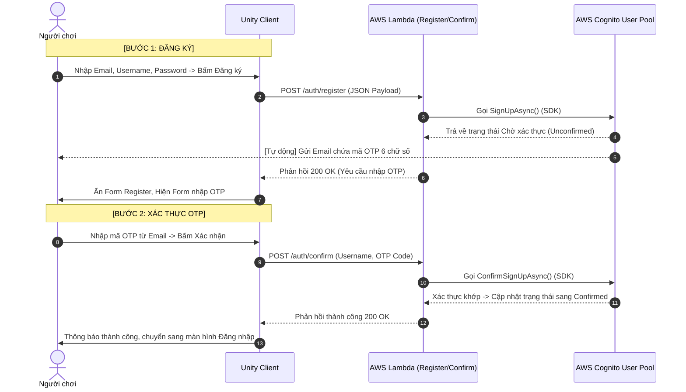
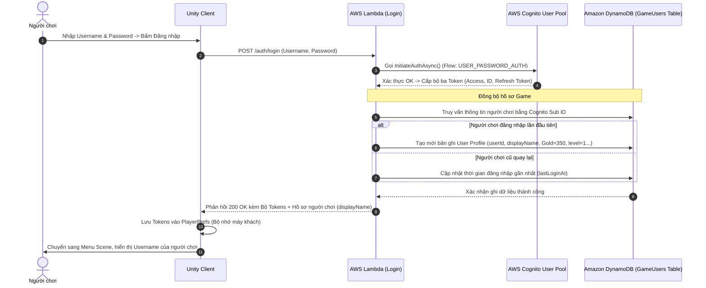
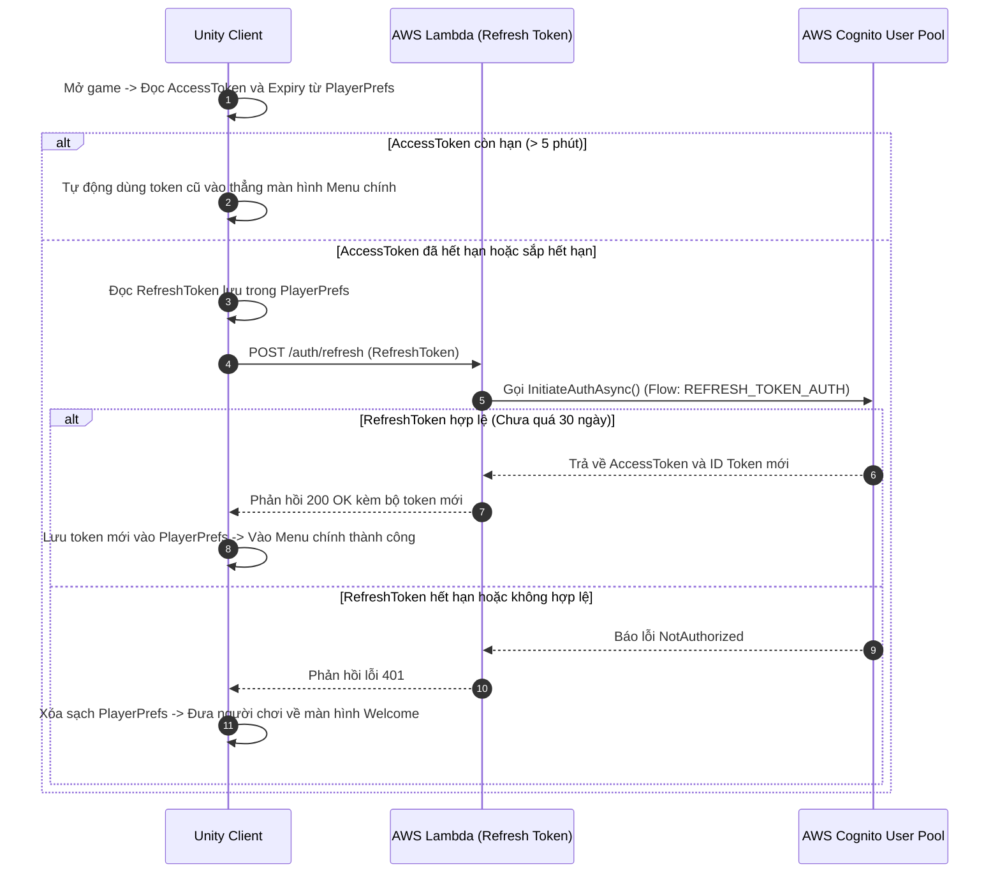

# BÁO CÁO KỸ THUẬT: TÍCH HỢP XÁC THỰC AWS COGNITO & ĐÁNH GIÁ CHI PHÍ VẬN HÀNH

Tài liệu này cung cấp chi tiết về **chi phí vận hành trên hệ thống AWS** và **luồng hoạt động chi tiết** của chức năng Đăng ký, Xác thực OTP và Đăng nhập tích hợp trong game RPG. Bạn có thể sử dụng nội dung dưới đây để sao chép trực tiếp vào file Word làm báo cáo dự án.

---

## PHẦN 1: BẢNG PHÂN TÍCH CHI PHÍ VẬN HÀNH AWS (REGION: SINGAPORE)

Hệ thống của chúng ta sử dụng kiến trúc Serverless (Không máy chủ) gồm 4 dịch vụ cốt lõi. Ưu điểm của kiến trúc này là **chỉ trả tiền khi có người chơi sử dụng** (Pay-as-you-go) và hỗ trợ gói miễn phí (Free Tier) rất rộng rãi.

### 1. Chi phí chi tiết theo từng dịch vụ

| Dịch vụ AWS | Gói miễn phí hàng tháng (Free Tier) | Chi phí khi vượt gói miễn phí | Cách hoạt động thực tế trong game |
| :--- | :--- | :--- | :--- |
| **AWS Cognito** | **50,000 MAU** (Monthly Active Users - Tài khoản hoạt động/tháng) | **$0.0055** / 1 MAU tiếp theo | Quản lý thông tin tài khoản, mật khẩu, gửi email xác thực OTP. Đăng ký/Đăng nhập 100 lần bởi 1 người chơi vẫn chỉ tính là **1 MAU**. |
| **Amazon API Gateway** | **1,000,000** lượt gọi API / tháng | **$3.50** / 1,000,000 lượt gọi tiếp theo | Cổng trung gian điều phối các yêu cầu từ Unity client gửi lên (Login, Register, Confirm, Refresh, Battle...). |
| **AWS Lambda** | **1,000,000** lượt chạy + **400,000 GB-giây** thời gian xử lý | **$0.20** / 1,000,000 lượt chạy tiếp theo | Chạy các đoạn code C# xử lý logic Login, Register... Thời gian chạy trung bình cực ngắn (~150ms). |
| **Amazon DynamoDB** | **25 GB** dung lượng lưu trữ (Free trọn đời) | **$0.25** / 1 GB tiếp theo / tháng | Lưu trữ thông tin hồ sơ nhân vật (điểm số, cấp độ, túi đồ, lịch sử chơi game). |

> [!NOTE]
> **MAU (Monthly Active User)** được tính là một người dùng thực hiện bất kỳ hành động đăng ký, đăng nhập hoặc làm mới token nào trong tháng đó. Nếu người đó không mở game trong cả tháng, họ sẽ không bị tính vào MAU.

### 2. Ước tính chi phí theo quy mô người chơi thực tế

#### Kịch bản A: Game mới phát hành (Dưới 10,000 người chơi hoạt động/tháng)
* **Tổng chi phí AWS: $0 / tháng (Hoàn toàn miễn phí)**
* *Giải thích:* Tất cả các số liệu sử dụng (MAU, số lượt gọi API, dung lượng dữ liệu lưu trong DynamoDB, thời gian chạy Lambda) đều nằm gọn trong gói Free Tier của AWS.

#### Kịch bản B: Game phát triển trung bình (50,000 người chơi hoạt động/tháng)
Giả định mỗi người chơi đăng nhập/gọi API 100 lần/tháng (Tổng cộng 5,000,000 lượt gọi API).
* **AWS Cognito:** $0 (Vừa vặn trong mức 50,000 MAU miễn phí).
* **API Gateway:** (5M - 1M miễn phí) = 4M yêu cầu x $3.50 = **$14.00**.
* **AWS Lambda:** (5M - 1M miễn phí) = 4M lượt chạy x $0.20 + chi phí CPU-time (~$5.00) = **$5.80**.
* **DynamoDB:** Lưu trữ 50,000 profile chỉ khoảng 1 GB = $0 (trong gói 25 GB miễn phí).
* **Tổng cộng: ~$19.80 / tháng** (Khoảng 500,000 VNĐ cho 50,000 người chơi).

#### Kịch bản C: Game quy mô lớn (100,000 người chơi hoạt động/tháng)
Giả định tổng cộng 12,000,000 lượt gọi API/tháng.
* **AWS Cognito:** (100k - 50k miễn phí) = 50k MAU x $0.0055 = **$275.00**.
* **API Gateway:** (12M - 1M miễn phí) = 11M yêu cầu x $3.50 = **$38.50**.
* **AWS Lambda:** (12M - 1M miễn phí) = 11M lượt chạy x $0.20 + CPU-time (~$12.00) = **$14.20**.
* **DynamoDB:** Khoảng 2 GB dữ liệu = $0 (trong gói 25 GB miễn phí).
* **Tổng cộng: ~$327.70 / tháng** (Khoảng 8,000,000 VNĐ cho 100,000 người chơi).

### 3. Khuyến nghị tối ưu hóa chi phí
* **Không bật tính năng xác thực OTP qua SMS (MFA SMS):** Gửi tin nhắn điện thoại tốn phí rất cao và không có gói miễn phí. Hệ thống hiện tại đang sử dụng **Email OTP** hoàn toàn miễn phí.
* **Tối ưu hóa thời gian giữ Token (Token Lifespan):** Đặt thời gian sống của Access Token hợp lý (ví dụ: 1 tiếng) để Unity không gọi API Refresh Token (`/auth/refresh`) quá liên tục, giúp tiết kiệm số lượt gọi API Gateway và Lambda.

---

## PHẦN 2: LUỒNG HOẠT ĐỘNG KỸ THUẬT (FLOWCHART / SEQUENCE)

Dưới đây là luồng truyền nhận dữ liệu giữa 3 thực thể chính: **Unity Client**, **API Gateway & AWS Lambda (Backend)**, và **AWS Cognito & DynamoDB (Database & Auth Provider)**.

### 1. Luồng Đăng ký Tài khoản (Register & OTP Verification)

### 2. Luồng Đăng nhập Hệ thống (Login & Session Creation)

### 3. Luồng Tự động đăng nhập bằng Token cũ (Silent Login / Auto Restore Session)

Mỗi lần mở game, người chơi không cần phải gõ lại mật khẩu nhờ luồng này:

