# Kế Hoạch: Authentication & Authorization System

## Tổng Quan

Game hiện tại đã có skeleton cho auth (UI Login/Register scene, `AuthApiService.cs`, `LoginHandler.cs`, `RegisterHandler.cs`, `AuthService.cs`, `IAuthService`, `JwtHelper.cs`) nhưng chưa kết nối hoàn chỉnh. Backend dùng `JwtHelper` tự viết (SHA256, không dùng thư viện JWT chuẩn), phía Unity dùng mock data trong `GameProgressService.SeedMockWorld()` — chưa có luồng đăng nhập/đăng ký thực sự.

Kế hoạch này chia làm **2 phương án song song**:

| | Plan A — Mock Local | Plan B — AWS Cognito |
|---|---|---|
| **Mục tiêu** | Test hoàn chỉnh trên máy, không cần AWS | Production-ready, zero auth code trên backend |
| **Chi phí** | $0 | Free tier: 50,000 MAU miễn phí |
| **Khi dùng** | Dev / CI testing | Staging & Production |
| **Token** | JWT tự ký (local) | Cognito JWT (RS256, auto-rotated) |
| **Chuyển đổi** | `GameConfigSO.useMockMode = true` | `GameConfigSO.useMockMode = false` |

---

## Open Questions

> [!IMPORTANT]
> **Confirm trước khi execute:**
>
> 1. **Shared DTO `RegisterRequest`**: Hiện tại `shared/DTOs/Auth/` chỉ có `LoginRequest.cs` và `LoginResponse.cs`. Có muốn thêm `RegisterRequest.cs` vào shared để tái dùng trên cả Unity và Backend không?
>
> 2. **Persist session giữa app sessions**: Token hiện tại sẽ lưu vào `PlayerPrefs` để tự động đăng nhập lại khi mở app. Có đồng ý không? Hay muốn đăng nhập lại mỗi lần mở game?
>
> 3. **Confirm Email (Cognito)**: AWS Cognito mặc định gửi email xác nhận sau khi đăng ký. Có muốn bật hay tắt tính năng này (auto-confirm)?
>
> 4. **Refresh Token**: Cognito cấp `AccessToken` (1h) + `RefreshToken` (30 ngày). Có muốn implement auto-refresh token trên Unity client không?

---

## Phương Án A — Mock Local (Test trên máy, $0)

### Mục tiêu
Tạo luồng Login → Register hoàn chỉnh mà **không gọi bất kỳ AWS service nào**. Dữ liệu lưu bằng `PlayerPrefs` (giả lập "server" ngay trên máy).

### Luồng hoạt động

```
Unity UI (LoginPanel)
  → AuthManager.LoginAsync(username, password)
    → [useMockMode=true] MockAuthService.LoginAsync()
      → Tìm user trong PlayerPrefs (JSON dictionary)
      → Verify password (SHA256 hash so sánh)
      → Tạo mock JWT token (fake, không verify được)
      → Lưu token vào PlayerPrefs["auth_token"]
      → Cập nhật GameProgressService.CurrentUser
    → [useMockMode=false] RealAuthService → ApiClient → AWS Backend
  ← AuthResult { success, token, userId, displayName, errorCode }
Unity UI: chuyển sang MainMenu scene
```

### Proposed Changes

---

#### Layer 1: Shared DTOs — `shared/`

##### [NEW] [RegisterRequest.cs](file:///d:/Unity/Project/AI-Dungeon-RPG-Adventure-Game/shared/DTOs/Auth/RegisterRequest.cs)
```csharp
// shared/DTOs/Auth/RegisterRequest.cs
namespace GameShared.DTOs.Auth {
    [Serializable]
    public class RegisterRequest {
        public string username;
        public string email;
        public string password;
        public string confirmPassword;
    }
}
```

##### [MODIFY] [LoginResponse.cs](file:///d:/Unity/Project/AI-Dungeon-RPG-Adventure-Game/shared/DTOs/Auth/LoginResponse.cs)
- Thêm field `refreshToken` (chuẩn bị cho Plan B — Cognito)
- Thêm field `errorCode` để phân biệt lỗi

##### [MODIFY] [User.cs](file:///d:/Unity/Project/AI-Dungeon-RPG-Adventure-Game/shared/Models/User.cs)
- Thêm field `cognitoSub` (string, nullable) — dự phòng cho Plan B

---

#### Layer 2: Unity Client — `Assets/Script/`

##### [NEW] `Assets/Script/Auth/IAuthService.cs` (Unity interface)
Interface cho cả Mock và Real auth. Tách biệt với backend `IAuthService`.
```csharp
public interface IUnityAuthService {
    Task<AuthResult> LoginAsync(string username, string password);
    Task<AuthResult> RegisterAsync(string username, string email, string password, string confirmPassword);
    Task LogoutAsync();
    bool IsLoggedIn { get; }
    string CurrentToken { get; }
}
public class AuthResult {
    public bool success;
    public string errorCode;    // "INVALID_CREDENTIALS", "USERNAME_EXISTS", etc.
    public string errorMessage;
    public string token;
    public string userId;
    public string displayName;
}
```

##### [NEW] `Assets/Script/Auth/MockAuthService.cs`
- Lưu users vào `PlayerPrefs["mock_users"]` dưới dạng JSON array
- Hash password bằng SHA256 (đồng nhất với backend)
- Tạo fake JWT dạng `"mock.{base64payload}.fakesig"`
- Lưu token vào `PlayerPrefs["auth_token"]` để persist session
- Simulate network delay: `await Task.Delay(500)` để giống thực tế
- **Mock users có sẵn** để test nhanh: `demo / password123`

##### [NEW] `Assets/Script/Auth/RealAuthService.cs`
- Wrap `AuthApiService.cs` hiện có
- Gọi `ApiClient.Instance.PostRawAsync("/auth/login", ...)`
- Parse response, lưu token qua `ApiClient.Instance.SetAuth(token)`
- Implement token persistence qua `PlayerPrefs`

##### [NEW] `Assets/Script/Auth/AuthManager.cs` (MonoBehaviour Singleton)
- Bootstrap khi game khởi động, quyết định dùng Mock hay Real dựa vào `GameConfigSO.Instance.useMockMode`
- Expose: `AuthManager.Instance.Login()`, `.Register()`, `.Logout()`, `.IsLoggedIn`, `.CurrentUser`
- Tự động đọc token từ `PlayerPrefs` khi khởi động (Auto-login)
- Tích hợp với `GameProgressService` để set `CurrentUser` sau login

##### [NEW] `Assets/Script/Auth/UI/LoginPanelController.cs`
- Gắn vào Login scene hiện tại (có sẵn trong Unity Editor theo screenshot)
- Kết nối với InputField-username, InputField-password, btn_Login, btn_Cancel
- Validate input: username không rỗng, password >= 6 ký tự
- Show loading spinner khi đang call async
- Show error message inline (không dùng popup)
- Chuyển sang MainMenu scene khi success

##### [NEW] `Assets/Script/Auth/UI/RegisterPanelController.cs`
- Gắn vào Register scene hiện tại
- Kết nối với InputField-email, InputField-username, InputField-password, InputField-confirm-password
- Validate: email format, password match, password >= 6 ký tự
- Show error inline theo từng field

##### [MODIFY] `Assets/Script/Config/GameConfigSO.cs`
- Thêm `[Header("Auth Settings")]`
- Thêm `public string awsCognitoUserPoolId` (cho Plan B)
- Thêm `public string awsCognitoClientId` (cho Plan B)
- Thêm `public string awsCognitoRegion` (cho Plan B)

---

#### Layer 3: Backend — `backend/`

##### [MODIFY] `backend/src/GameBackend.Core/Services/AuthService.cs`
- Thay `SHA256` bằng **BCrypt** (NuGet: `BCrypt.Net-Next`) cho production-level security
- Thêm method `RefreshTokenAsync()` (chuẩn bị cho Plan B)
- Cải thiện `ValidateTokenAsync()` dùng `System.IdentityModel.Tokens.Jwt`

##### [MODIFY] `backend/src/GameBackend.Core/Utils/JwtHelper.cs`
- Dùng `System.IdentityModel.Tokens.Jwt` thay vì HMAC thủ công
- Validate expiry, signature đúng chuẩn

##### [MODIFY] `backend/src/GameBackend.Handlers/Handlers/Auth/RegisterHandler.cs`
- Deserialize sang `RegisterRequest` DTO (từ shared) thay vì `JsonElement` raw
- Thêm validate `confirmPassword`

##### [MODIFY] `backend/src/GameBackend.Core/Repositories/Interfaces/IUserRepository.cs`
- Thêm `GetByEmailAsync(string email)` để check email duplicate khi đăng ký

##### [MODIFY] `backend/src/GameBackend.Core/Repositories/UserRepository.cs`
- Implement `GetByEmailAsync()`

##### [MODIFY] `backend/src/GameBackend.Handlers/DependencyInjection/ServiceProviderBuilder.cs`
- Thêm env var `JWT_ISSUER`, `JWT_AUDIENCE` cho JwtHelper
- Không thay đổi cấu trúc DI

---

## Phương Án B — AWS Cognito (Production)

### Mục tiêu
Tích hợp **AWS Cognito User Pool** làm identity provider. Cognito lo toàn bộ: hash password, JWT issue/validate, email verification, forgot password. Backend Lambda **không còn cần AuthService/JwtHelper** — chỉ trust token từ Cognito thông qua API Gateway Authorizer.

### Kiến trúc Cognito

```
Unity Client
  ↓ AMAZON COGNITO SDK (Cognito Hosted UI hoặc SDK call)
  ↓ POST https://cognito-idp.{region}.amazonaws.com/
  ↓ InitiateAuth → IdToken + AccessToken + RefreshToken
  ↓
  → Gọi API Gateway với Header: Authorization: Bearer {AccessToken}
  ↓
API Gateway Cognito Authorizer (validate JWT tự động, không cần Lambda)
  ↓
Lambda Handler (nhận request với context.Identity đã verified)
```

### Thay đổi so với Plan A

#### Cognito sẽ thay thế hoàn toàn

| Thứ cần xóa/bỏ | Lý do |
|---|---|
| `JwtHelper.cs` | Cognito cấp và ký JWT, không cần tự tạo |
| `AuthService.LoginAsync()` (phần verify password) | Cognito xử lý, Lambda chỉ cần gọi `InitiateAuth` SDK |
| `AuthService.HashPassword()` / `VerifyPassword()` | Cognito quản lý password, không lưu hash trong DynamoDB |
| `UserRepository.GetByUsernameAsync()` (cho login) | Login qua Cognito, không query DynamoDB để verify |

#### Cognito sẽ bổ sung thêm

| Tính năng mới | Tự động qua Cognito |
|---|---|
| Email verification | ✅ Gửi OTP email sau register |
| Forgot password | ✅ Gửi reset link qua email |
| MFA | ✅ TOTP/SMS optional |
| JWT RS256 signing | ✅ Auto-rotate keys, JWKS endpoint |
| Rate limiting | ✅ Built-in throttle |
| Token refresh | ✅ RefreshToken 30 ngày |

---

### Proposed Changes (Plan B)

#### Layer 0: Infrastructure CDK — `infrastructure/`

##### [MODIFY] `infrastructure/src/Infrastructure/Stacks/ApiStack.cs`
- Tạo **Cognito User Pool** với cấu hình:
  - `SelfSignUpEnabled = true`
  - `AutoVerify = { Email }` (hoặc tắt nếu muốn skip verify)
  - Password policy: min 8 chars, require number
- Tạo **Cognito User Pool Client** (App Client) không có client secret (Unity mobile không bảo mật được secret)
- Tạo **CognitoUserPoolsAuthorizer** gắn vào API Gateway
- Gắn Authorizer vào tất cả routes trừ `/auth/*`
- Output: `UserPoolId`, `UserPoolClientId`

```csharp
// Trong ApiStack.cs
var userPool = new UserPool(this, "GameUserPool", new UserPoolProps {
    SelfSignUpEnabled = true,
    AutoVerify = new AutoVerifiedAttrs { Email = true },
    PasswordPolicy = new PasswordPolicy {
        MinLength = 8,
        RequireDigits = true,
        RequireLowercase = true,
        RequireUppercase = false,
        RequireSymbols = false
    },
    AccountRecovery = AccountRecovery.EMAIL_ONLY
});

var userPoolClient = userPool.AddClient("GameMobileClient", new UserPoolClientOptions {
    AuthFlows = new AuthFlow { UserPassword = true, UserSrp = true },
    GenerateSecret = false   // Mobile app không cần client secret
});

var cognitoAuthorizer = new CognitoUserPoolsAuthorizer(this, "CognitoAuth", 
    new CognitoUserPoolsAuthorizerProps {
        CognitoUserPools = new[] { userPool }
    });
```

##### [NEW] `infrastructure/src/Infrastructure/Stacks/CognitoStack.cs`
Tách riêng Cognito resources cho dễ quản lý.

---

#### Layer 1: Backend — `backend/`

##### [NEW] `backend/src/GameBackend.Core/Services/CognitoAuthService.cs`
Thay thế `AuthService.cs` khi dùng Plan B:
- `LoginAsync()`: Gọi Cognito SDK `AmazonCognitoIdentityProviderClient.InitiateAuthAsync()` với `USER_PASSWORD_AUTH` flow → trả về `IdToken`, `AccessToken`, `RefreshToken`
- `RegisterAsync()`: Gọi `SignUpAsync()` → Cognito tạo user, gửi verification email
- `ConfirmSignUpAsync()`: Gọi `ConfirmSignUpAsync()` với OTP code từ email
- `RefreshTokenAsync()`: Gọi `InitiateAuthAsync()` với `REFRESH_TOKEN_AUTH`
- `ForgotPasswordAsync()` / `ConfirmForgotPasswordAsync()`

**Quan trọng**: `LoginAsync` trên Cognito sẽ **không cần DynamoDB** vì Cognito là source of truth cho auth. DynamoDB chỉ lưu game data (character, inventory...).

##### [MODIFY] `backend/src/GameBackend.Core/Services/Interfaces/IAuthService.cs`
- Thêm `ConfirmSignUpAsync(string username, string code)`
- Thêm `RefreshTokenAsync(string refreshToken)`
- Thêm `ForgotPasswordAsync(string username)`

##### [MODIFY] `backend/src/GameBackend.Handlers/Handlers/Auth/LoginHandler.cs`
- Đổi business logic: thay vì query DynamoDB để verify password, gọi `ICognitoAuthService.LoginAsync()`
- Nhận token từ Cognito, trả về cho client

##### [NEW] `backend/src/GameBackend.Handlers/Handlers/Auth/ConfirmSignUpHandler.cs`
- Route: `POST /auth/confirm`
- Nhận `{ username, confirmationCode }`

##### [NEW] `backend/src/GameBackend.Handlers/Handlers/Auth/RefreshTokenHandler.cs`
- Route: `POST /auth/refresh`
- Nhận `{ refreshToken }` → gọi Cognito refresh

##### [MODIFY] `backend/src/GameBackend.Handlers/DependencyInjection/ServiceProviderBuilder.cs`
- Thêm `AmazonCognitoIdentityProviderClient` (Singleton)
- Swap `IAuthService → CognitoAuthService` (thay vì `AuthService`)
- Đọc env vars: `COGNITO_USER_POOL_ID`, `COGNITO_CLIENT_ID`

##### [MODIFY] `backend/src/GameBackend.Core/Repositories/UserRepository.cs`
- **Không cần** `GetByUsernameAsync()` để verify password nữa
- Chỉ cần `GetByCognitoSubAsync(string cognitoSub)` để map Cognito user sang game user profile
- `SaveAsync()` vẫn cần để lưu game data (character links, display name...)

##### [MODIFY] `shared/Models/User.cs`
- Xóa field `passwordHash` (Cognito quản lý, không cần lưu trong game DB)
- Thêm field `cognitoSub` (Cognito's unique user ID, dùng làm FK)

---

#### Layer 2: Unity Client — `Assets/Script/Auth/`

##### [NEW] `Assets/Script/Auth/CognitoAuthService.cs`
Thay thế `RealAuthService.cs` khi Plan B:
- Gọi API Gateway endpoints (`/auth/login`, `/auth/register`, `/auth/confirm`)
- Không gọi Cognito SDK trực tiếp từ Unity (để tránh phụ thuộc AWS SDK trong game client)
- Store tokens: `PlayerPrefs["cognito_access_token"]`, `PlayerPrefs["cognito_refresh_token"]`
- Auto-refresh: kiểm tra token expiry trước mỗi API call, nếu gần hết hạn thì gọi `/auth/refresh`

**Lưu ý**: Unity client gọi backend Lambda endpoint → Lambda gọi Cognito SDK. Không gọi Cognito trực tiếp từ Unity để dễ bảo trì và bảo mật.

##### [NEW] `Assets/Script/Auth/UI/ConfirmSignUpController.cs`
- UI nhập OTP code 6 chữ số sau khi đăng ký
- Gắn vào scene xác nhận email (cần tạo scene mới hoặc thêm panel)
- Nút "Resend Code"

---

### Shared DTOs (Plan B bổ sung)

##### [NEW] `shared/DTOs/Auth/RefreshTokenRequest.cs`
```csharp
namespace GameShared.DTOs.Auth {
    public class RefreshTokenRequest {
        public string refreshToken;
    }
}
```

##### [NEW] `shared/DTOs/Auth/ConfirmSignUpRequest.cs`
```csharp
namespace GameShared.DTOs.Auth {
    public class ConfirmSignUpRequest {
        public string username;
        public string confirmationCode;
    }
}
```

##### [MODIFY] `shared/DTOs/Auth/LoginResponse.cs`
```csharp
// Thêm vào LoginResponse
public string refreshToken;     // Cognito refresh token (30 ngày)
public string idToken;          // Cognito ID token (user info)
public string errorCode;        // Error classification
```

---

## So Sánh Chi Tiết 2 Plan

```mermaid
flowchart TD
    subgraph PlanA["Plan A — Mock Local"]
        A1["Unity UI"] --> A2["AuthManager"]
        A2 -->|useMockMode=true| A3["MockAuthService"]
        A3 --> A4["PlayerPrefs (local storage)"]
        A4 --> A5["Fake JWT token"]
        A5 --> A6["GameProgressService.CurrentUser"]
    end

    subgraph PlanB["Plan B — AWS Cognito"]
        B1["Unity UI"] --> B2["AuthManager"]
        B2 -->|useMockMode=false| B3["RealAuthService / CognitoAuthService"]
        B3 --> B4["API Gateway /auth/login"]
        B4 --> B5["Lambda LoginHandler"]
        B5 --> B6["AWS Cognito SDK"]
        B6 --> B7["Cognito User Pool"]
        B7 -->|JWT RS256| B5
        B5 --> B4
        B4 --> B3
        B3 --> B8["PlayerPrefs (AccessToken + RefreshToken)"]
        B8 --> B9["ApiClient.SetAuth(token)"]
        B9 --> B10["GameProgressService.CurrentUser"]
    end
```



---

## Verification Plan

### Plan A — Mock Local

**Manual Testing:**
1. Chạy Unity Editor, mở scene Login
2. Đăng ký tài khoản mới → verify redirect sang Register thành công
3. Login với tài khoản vừa tạo → verify MainMenu load đúng user
4. Thoát game, mở lại → verify auto-login (token persist)
5. Login sai password → verify error message đúng
6. Đăng ký username đã tồn tại → verify error "USERNAME_EXISTS"

**Build Test:**
```powershell
# Build shared DLL
dotnet build shared/GameShared.csproj -c Debug
# Verify file copy sang Assets/Plugins/
Test-Path "Assets/Plugins/GameShared.dll"
```

### Plan B — AWS Cognito

**AWS Console Verify:**
1. `aws cognito-idp list-users --user-pool-id {id}` → thấy user sau khi đăng ký
2. `aws cognito-idp admin-confirm-sign-up` → test confirm OTP
3. API Gateway test console → verify Cognito Authorizer block request không có token

**Integration Test (.NET):**
```powershell
cd backend
dotnet test tests/GameBackend.Tests/
```

**CDK Deploy (sau khi approve):**
```powershell
cd infrastructure
cdk deploy --all
```

---

## Thứ Tự Thực Hiện (Execution Order)

### Giai Đoạn 1 — Foundation (cả 2 plan dùng chung)
1. Cập nhật `shared/DTOs/Auth/` (RegisterRequest, LoginResponse mở rộng)
2. Cập nhật `shared/Models/User.cs` (thêm cognitoSub)
3. Build GameShared.dll → copy vào Assets/Plugins

### Giai Đoạn 2 — Plan A: Mock Local
4. Tạo `IUnityAuthService.cs` + `AuthResult.cs`
5. Tạo `MockAuthService.cs`
6. Tạo `RealAuthService.cs` (wrap AuthApiService)
7. Tạo `AuthManager.cs` (Singleton, DI chọn Mock/Real)
8. Tạo `LoginPanelController.cs`
9. Tạo `RegisterPanelController.cs`
10. Gắn Controllers vào scene trong Unity Editor
11. Test toàn bộ luồng

### Giai Đoạn 3 — Backend Hardening (cả 2 plan)
12. Sửa `JwtHelper.cs` dùng `System.IdentityModel.Tokens.Jwt`
13. Sửa `AuthService.cs` dùng BCrypt
14. Sửa `RegisterHandler.cs` dùng `RegisterRequest` DTO
15. Thêm `GetByEmailAsync()` vào IUserRepository + UserRepository

### Giai Đoạn 4 — Plan B: AWS Cognito (sau khi Plan A hoàn tất)
16. Tạo `CognitoStack.cs` trong infrastructure CDK
17. Sửa `ApiStack.cs` thêm Cognito Authorizer
18. Tạo `CognitoAuthService.cs` (backend)
19. Sửa `ServiceProviderBuilder.cs` (swap IAuthService)
20. Tạo `RefreshTokenHandler.cs`, `ConfirmSignUpHandler.cs`
21. Tạo `CognitoAuthService.cs` (Unity)
22. Tạo `ConfirmSignUpController.cs` (Unity UI)
23. CDK deploy → integration test

---

> [!NOTE]
> **Chiến lược chuyển đổi**: Toàn bộ thiết kế đảm bảo việc chuyển từ Plan A sang Plan B chỉ cần:
> 1. Toggle `GameConfigSO.useMockMode = false` trên Unity
> 2. CDK deploy Cognito stack
> 3. Điền `UserPoolId` + `ClientId` vào `GameConfigSO`
> Không cần sửa UI code, không cần sửa game logic.
